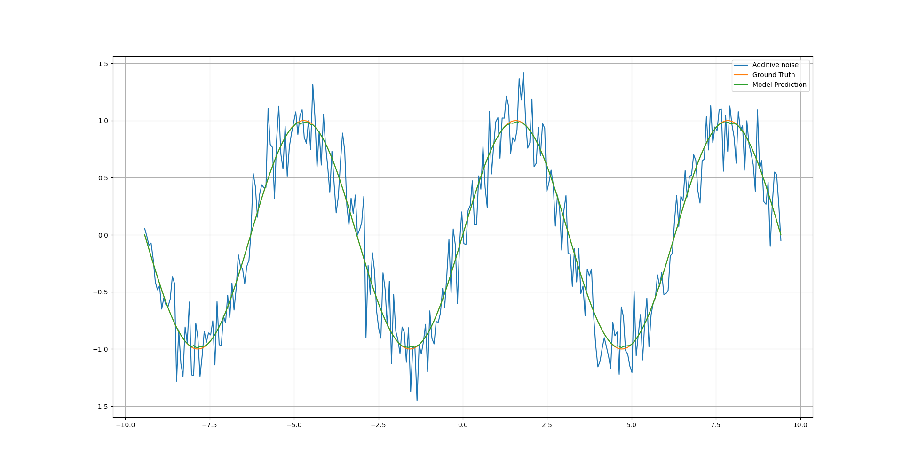

# Additive Noise Filter with a Deep Neural Network

The model used is based on a Fully Connected Network

Note that the dataset will be created at run time. The noise has a normal distribution (mean 0 and variance 1), scaled by a 0.2 factor.

## Test

The model was trained for 15 epochs, with a batch size of 16.

##### Note
To plot the scheme of the model you need to install [graphviz](https://graphviz.org/download/)
