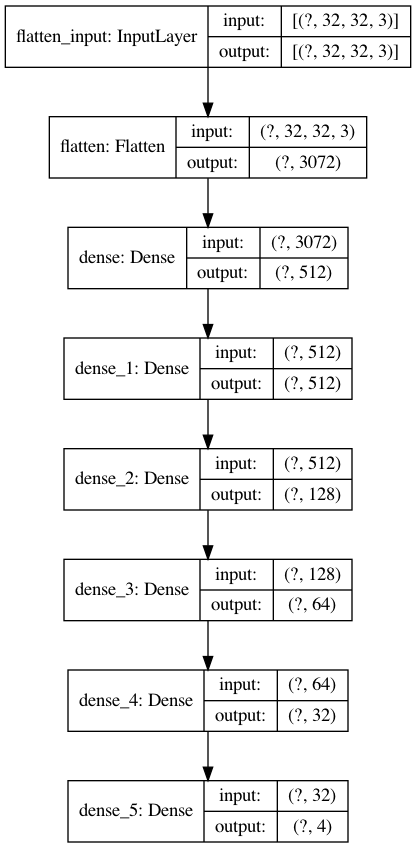
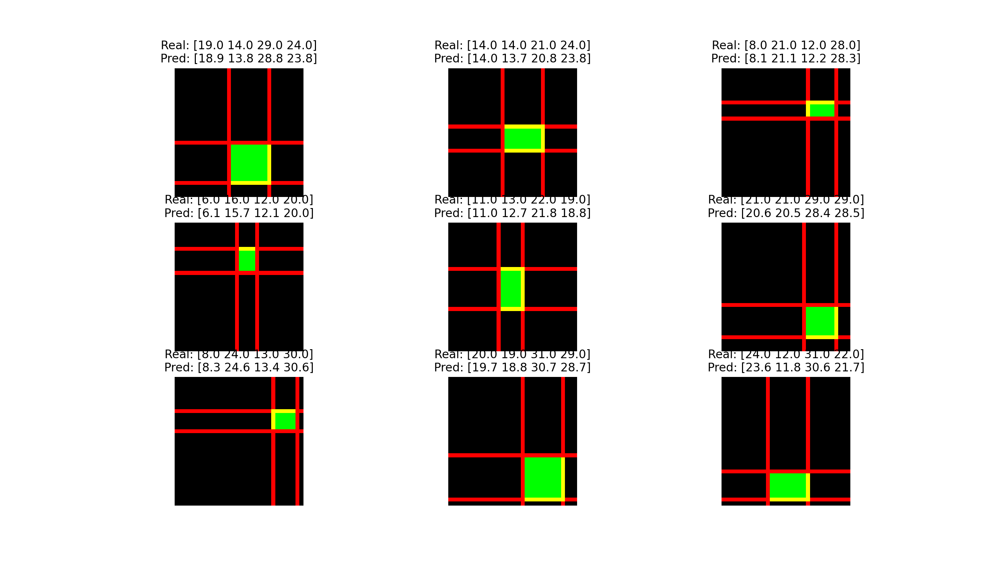

# Image Classification

The model used is based on a Fully Connected Network

Note that the dataset will be created at run time. There are 3 (red, blue and green square) + 1 classes (no square)

## Test

The model was trained for 10 epochs, with a batch size of 16.

##### Note
To plot the scheme of the model you need to install [graphviz](https://graphviz.org/download/)
